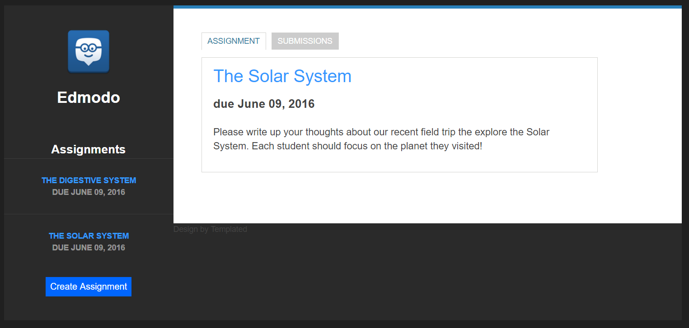
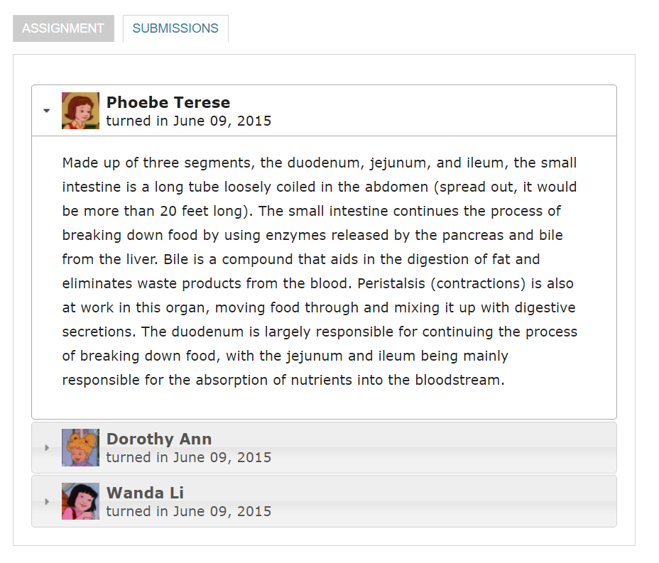
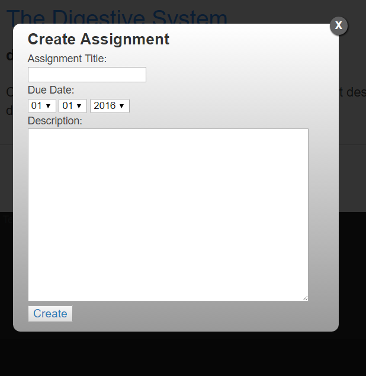

---------------------
Edmodo Coding Challenge
By: Anurag Baddam
---------------------

This webpage allows a teacher to browse his/her assignments and the submissions for a particular assignment. It implements the 
required features for this coding challenge as well as numerous optional features (options 2 and 3 to be exact). The actual page is
the index.html file. The fonts, images, and css files used are also included in the directory.

Here are some of the key features:
* A teacher can see a sidebar list of assignments with title and due date.
* A teacher can select an assignment by clicking on it in the sidebar.
* A teacher can toggle between assignment details and student submissions for the selected assignment.
    * Please note that some assignments return two identical entries from the same student from the API call. Both are included.
* A teacher can expand a student submission in place to see the submission content.
* Reloading a page with a selected assignment keeps the assignment selected.
* Teachers can create a new assignment. The assignment will be added to the sidebar and be selectable.
    * The modal will ensure that you enter some non-empty title and description, and it only allows you to choose an actual date, and
      it even checks for leap years!
    * Please note this new assignment is only shown on the client (there is no API call involved). Also, I have decided that
      if we reload a page after creating a new assignment, it disappears because since we did not implement a way to delete assignments
      (which is dangerous because then someone could delete an assignment and void submissions for it), there would be no way to erase
      an assignment with a typo or other such error.
    * For this same reason, reloading a page with a created assignment selected will go back to the "Please choose an assignment" 
      message. Deleting them is safe since they have no submissions.  
* When you switch assignments, the page remembers whether you were on the assignment or submissions tab and maintains it for the 
  new assignment as well.
* PLEASE TEST THIS PAGE USING GOOGLE CHROME OR FIREFOX. IE AND EDGE HAVE SHOWN TO BE BUGGY WITH THE JAVASCRIPT. THANKS.

**This site uses the Custom CSS template Privy from Templated. It has been heavily modified for this specific use case. The API is from
  Edmodo. Code and design is by me, Anurag Baddam. Please enjoy the site and report any bugs to baddamanu@berkeley.edu. Cheers!
 
###### Layout of the site

###### Submissions Tab

###### New Assignment Creation

